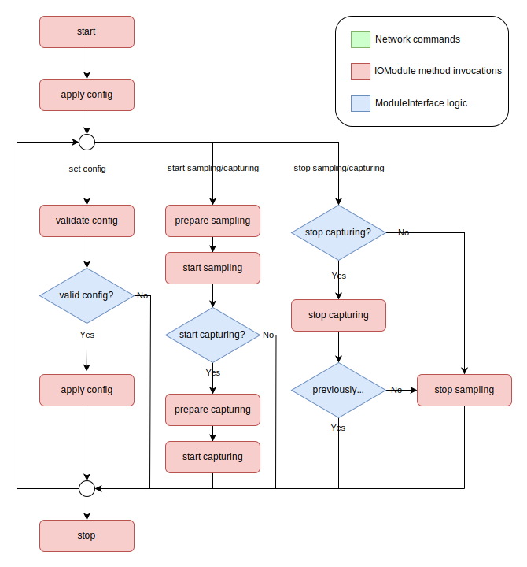

## Development

### Install Dependencies
```
sudo apt-get install git git-lfs make
git lfs install
```


### Setting up a Development Environment
Currently only Ubuntu (24.04) is officially supported. (The C++ build process checks the output of `lsb_release -sr`, requiring Ubuntu.)

Python modules require Python 3.12 or newer.

Install all requirements and initialize development environment with:
```
git clone https://github.com/virtual-vehicle/databeam.git
cd databeam
make develop
```
This will take some time to install and compile the necessary dependencies for debugging.

The following will be installed:
* cross-platform build support: binfmt-support, qemu-user-static
* Docker
* custom dependencies by modules (none by default)
* Python: python3, python3-pip, python3-venv
* C++ build support: pipx, cmake, ninja-build, libusb-1.0-0-dev, pkg-config

> **_NOTE:_** To allow for more complicated USB device setups, the development make rule increases the USB memory in the systems Grub configuration to 1000 MB.

A Python virtual environment will be created in `extensions/.venv` to run custom extensions.

For the Docker build process, base-images are needed. Build or update by running:
```
BUILD_LOCAL=1 make pull-images
BUILD_LOCAL=1 make base-all
```

### Update Development Environment
#### Update Base-Images
re-run `BUILD_LOCAL=1 make update`

#### Update Venvs and Dependencies
re-run `make develop`

This re-installs python venvs and external libraries.

After updating, re-build all needed images:

`BUILD_LOCAL=1 make core-apps module-XXX`


### Module Development
* templates are available in `templates`directory: copy folder into `io_modules` directory and start coding.
* channel names must only use characters: [a-zA-Z0-9_-]
* when running modules in debugger, make sure to properly set required environment variables

When you develop a new module, there are several files you need to create/modify:

* after copying the `templates`directory, rename **all** occurences of the string `template` in all files and filenames. Especially take care of the Dockerfile, config file, and the source files
* create a new docker-compose.module.yml in the deploy/compose-files directory and adapt to your modules name and needs
* include the new docker-compose.module.yml in the root docker-compose.yml

A basic lifecycle of a module looks like this:
<div align="center">
  
</div>

#### Python specific:
* use python venv in `extensions/.venv`
* make sure PYTHONPATH includes `extensions`, `libs` directories

#### C++ specific:
* the template provides a .vscode workspace
  - Open workspace in Visual Studio Code:
    - File -> Open Workspace from File -> select xxx.code-workspace file
  - use task "Configure DataBeam-C++ Module" to initialize build environment
  - use task "Build DataBeam-C++ Module" for compiling

### Run the Stack as a Developer
Modify local DataBeam-ID `DB_ID` to something unique like *testinstance* in `.env` file (repository root).

Modify `docker-compose.yml` to your wishes.

Build example (add other modules in make command if needed by docker-compose):
```
BUILD_LOCAL=1 make core-apps module-ping
```

Run:
```
make run
(quit with CTRL-C)
```
Navigate to http://localhost:5000 to explore the Web-GUI.

<div align="right">(<a href="README.md">back to README</a>)</div>
